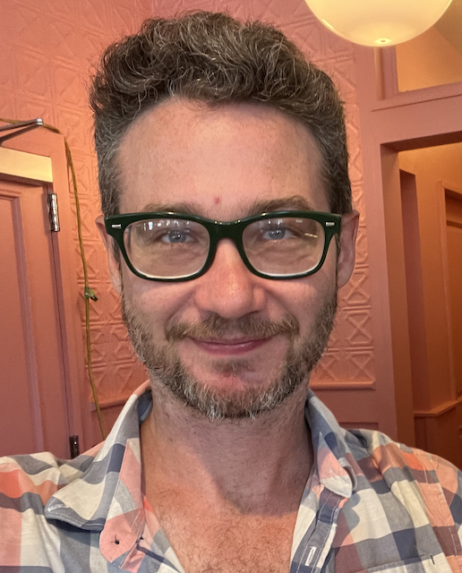

<!-- #region -->
# E. Paxon Frady

Hi! I am lead neuromorphic algorithms and theory researcher at Intel.

I was previously a post-doc at the Redwood Center for Theoretical Neuroscience at UC Berkeley. I did my Ph.D. in Neuroscience at UC San Diego, and majored in Computation and Neural Systems for undergrad at Caltech. 

[C.V.](https://github.com/epaxon/epaxon.github.io/raw/master/files/epfrady_cv_250904.pdf)
<!-- #endregion -->
